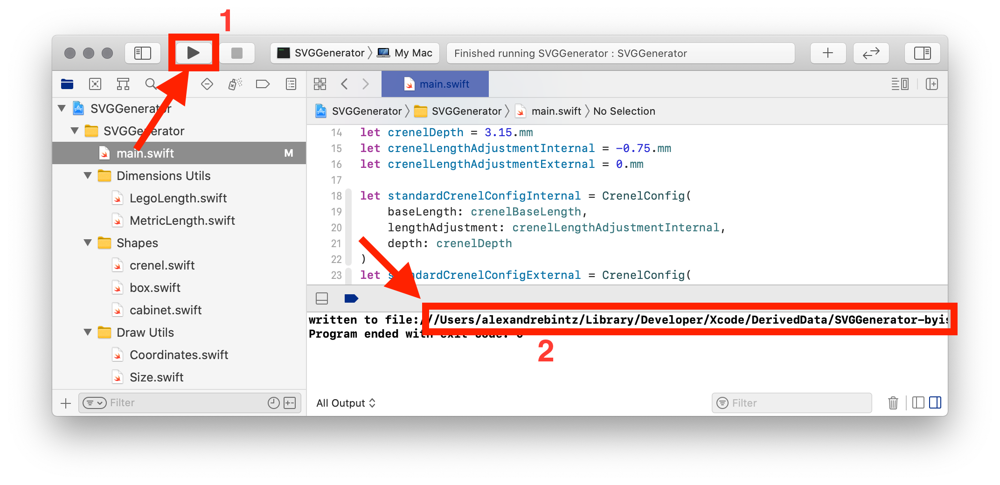

# SVG Generator

This project is a scripting framework written in Swift that helps me generate SVG files that I then feed to a LASER cutter to build wooden boxes and various storage units to store my LEGO collection. #iloveswift #ilovelego

## Usage

1. Open the project in Xcode
1. Edit the code in `main.swift` to make it generate the shape you want
1. Click Run. The path to the generated SVG file is printed in the output console

I use [Inkscape](https://inkscape.org/) to view and post-process the generated shapes.

The LASER cutter does not directly accept SVG as input, so I use Inkscape command line to batch convert my SVG files to DXF format:

    inkscape --export-type="dxf" *.svg

## Simple shapes

### CrenelSegment

A line with crenelations.

### PunchesSegment

A set of rectangles aligned and spaces equally.

### BoxFace

A rectangle that can have crenalations on its sides.
Uses CrenelSegments.

## Multi components shapes

### CrenelBox

A template composed of five box faces that can be assembled to form an open box.
The top-most shape is the box's bottom, then come the four sides.

