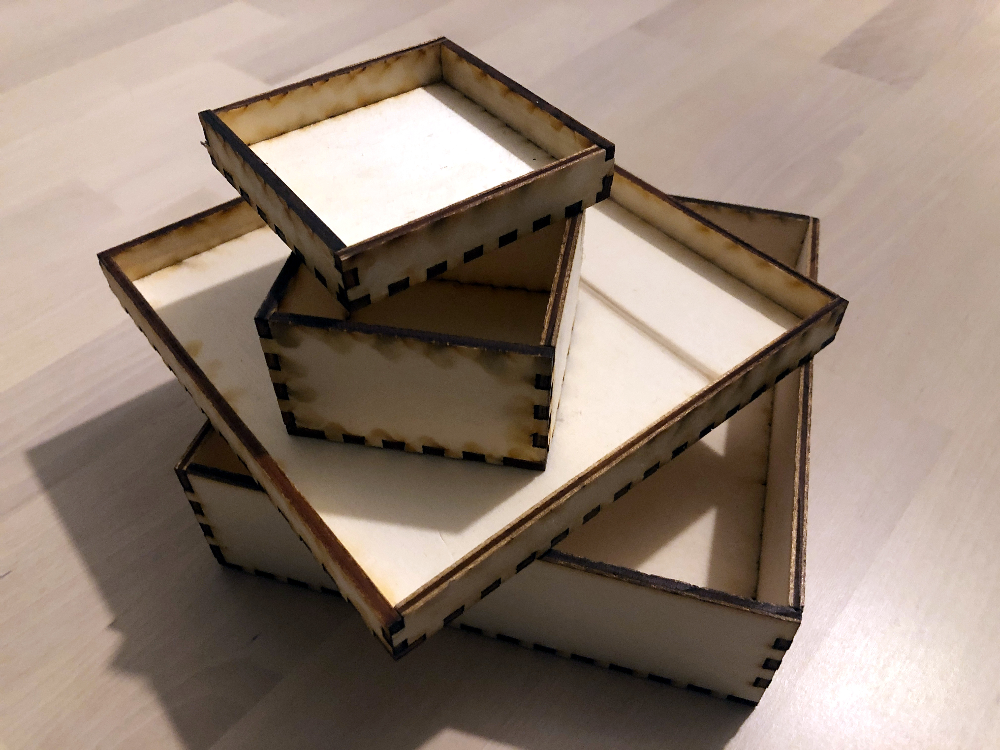
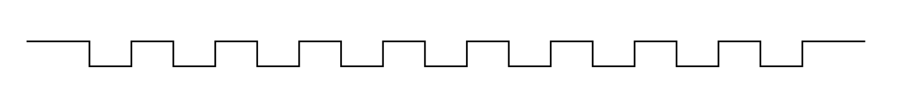
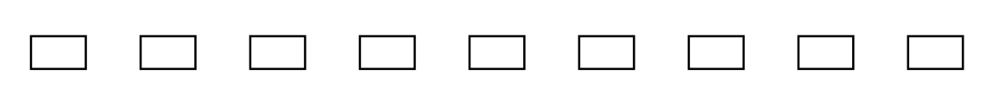
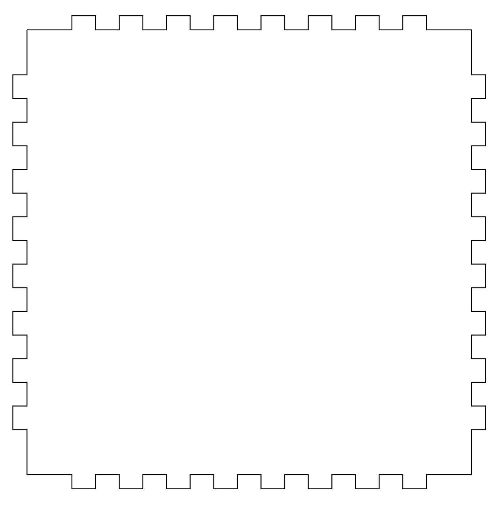
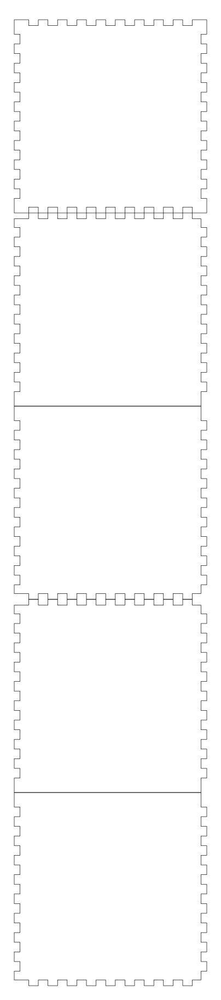

# CNCParametricDraw

This Swift package is a scripting framework that helps me generate SVG files that I then feed to a LASER cutter to build wooden boxes and various storage units to store my LEGO collection. #iloveswift #ilovelego

## Parametric Drawing

Parametric drawing is a type of drawing that draws shapes based on parameters.
Parametric drawing uses elementary shapes and operations that act on those shapes.
Elementary shapes and operations are each defined by a set of parameters that contain all the information required to draw the actual shape or perform the operation.
The actual drawing is inflated from all the parameters every time it is required.

The main advantage of parametric drawing is that it is easy to modify the drawing at each step.

## Overall design

### Parametric shapes

Several Swift types are created to represent various shapes.
Each type contains all the properties required to unambiguously define the shape.
Every property can be modified at any point in time.
When needed, the actual paths are generated based on the shape's properties.

### The Path type and PathRepresentable protocol

The `Path` type represents an abstract path composed of one or more commands.
Path commands are inspired by the SVG path spec but are meant to be independant of the rendering engine used.

Types can be created to represent arbitrarily complex shapes, that can all utltimately be expressed as a path.
Shape types implement the  `PathRepresentable` protocol which requires a readable `path` property of type `Path`.

### The PathsLayout type and PathsLayoutRepresentable protocol

The `PathsLayout` type is a collection of one or more paths that all have a fixed position.

Paths layouts are usefull for shapes that cannot be represented as a single path.
Types that represent shapes that cannot be represented as a single path implement the  `PathsLayoutRepresentable` protocol which requires a readable `pathsLayout` property of type `PathsLayout`.

## Simple shapes

### CrenelSegment

A line with crenelations.

### PunchesSegment

A set of rectangles aligned and spaces equally.

### BoxFace

A rectangle that can have crenalations on its sides.
Uses CrenelSegments.

## Multi components shapes

### CrenelBox

A template composed of five box faces that can be assembled to form an open box.
The top-most shape is the box's bottom, then come the four sides.

